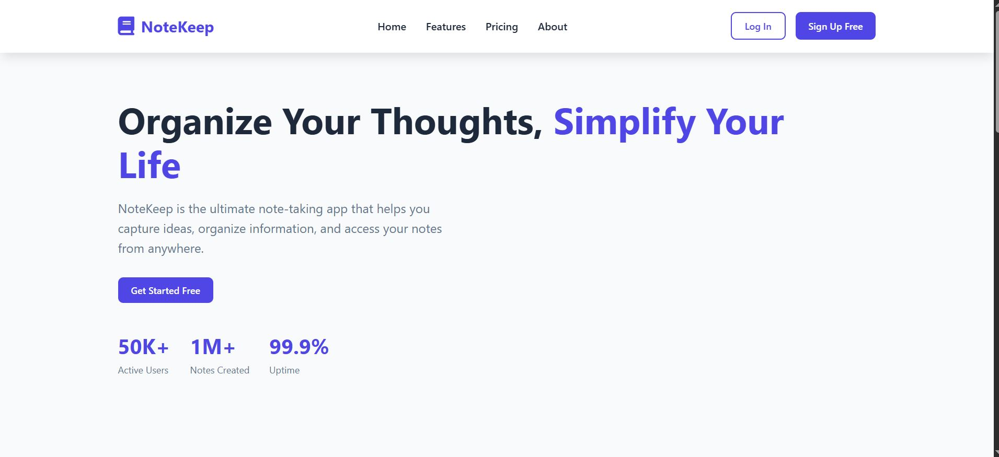
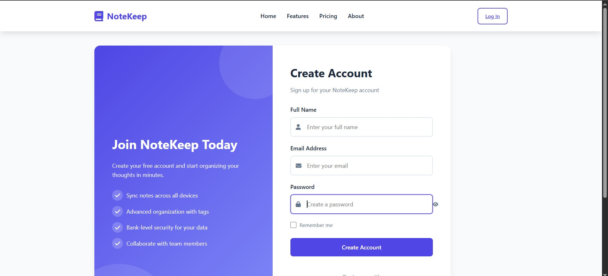
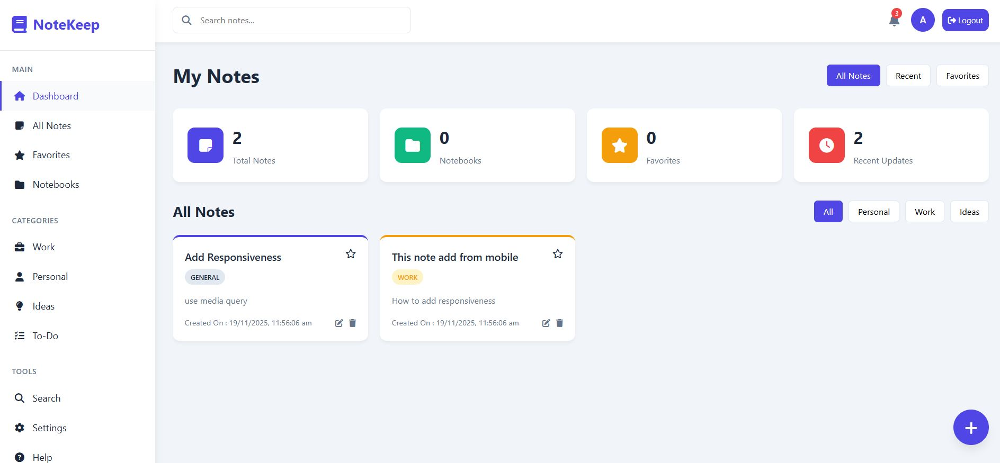
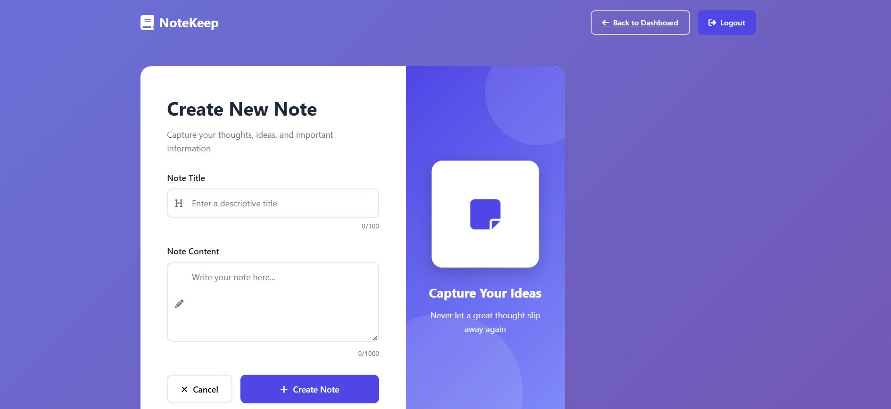

# Notes_App_Frontend-

# NoteKeep - Full Stack Note Taking Application


FrontEnd Deployment Link : https://notekeep01.netlify.app   

Backend Deployment Link :  https://notes-app-backend-8xaj.onrender.com

 
A beautiful, responsive full-stack note-taking application built with Express.js backend and vanilla HTML/CSS/JavaScript frontend.

# Project Screenshots : 

* Index page


* Signup page


*Main page


* Add note section

 


## 📋 Table of Contents

- [Features](#features)
- [Tech Stack](#tech-stack)
- [Project Structure](#project-structure)
- [Installation](#installation)
- [API Endpoints](#api-endpoints)
- [Frontend Pages](#frontend-pages)
- [Screenshots](#screenshots)
- [Contributing](#contributing)
- [License](#license)

## ✨ Features

### 🔐 Authentication
- User registration and login
- Secure password handling
- Session management
- Protected routes

### 📝 Note Management
- Create, read, update, and delete notes
- Rich text note content
- Categorization and tagging
- Search and filter functionality
- Favorite notes

### 🎨 User Experience
- Responsive design for all devices
- Beautiful animations and transitions
- Intuitive user interface
- Real-time feedback
- Auto-save drafts

### 🔧 Technical Features
- RESTful API architecture
- MongoDB integration
- Error handling and validation
- Security best practices

## 🛠 Tech Stack

### Backend
- **Express.js** - Web framework
- **MongoDB** - Database
- **Mongoose** - ODM
- **JWT** - Authentication
- **bcrypt** - Password hashing
- **CORS** - Cross-origin requests

### Frontend
- **HTML5** - Markup
- **CSS3** - Styling with custom properties
- **Vanilla JavaScript** - Interactivity
- **Font Awesome** - Icons

## 📁 Project Structure
```
notekeep-app/
├── backend/
│ ├── models/
│ │ ├── User.js
│ │ └── Note.js
│ ├── routes/
│ │ ├── auth.js
│ │ └── notes.js
│ ├── middleware/
│ │ ├── auth.js
│ │ └── validation.js
│ ├── config/
│ │ └── database.js
│ ├── .env
│ └── server.js
├── frontend/
│ ├── index.html # Landing page
│ ├── login.html # Login page
│ ├── signup.html # Registration page
│ ├── dashboard.html # Main dashboard
│ └── add-note.html # Create note page
└── README.md
```

## 🚀 Installation

### Prerequisites
- Node.js (v14 or higher)
- MongoDB (local or Atlas)
- Modern web browser

### Backend Setup

1. **Navigate to backend directory**
   ```bash
   cd backend

PORT=3000

JWT_TOKEN = shhhhh  
 

 🔌 API Endpoints : 
Authentication Routes
Method	Endpoint	Description	Body
POST	/api/auth/register	User registration	{name, email, password}
POST	/api/auth/login	User login	{email, password}
POST	/api/auth/logout	User logout	-


Notes Routes : 

Method	Endpoint	Description	Headers
GET	/api/notes	Get all user notes	Authorization: Bearer <token>
GET	/api/notes/:id	Get single note	Authorization: Bearer <token>
POST	/api/notes	Create new note	Authorization: Bearer <token>
PUT	/api/notes/:id	Update note	Authorization: Bearer <token>
DELETE	/api/notes/:id	Delete note	Authorization: Bearer <token>
 